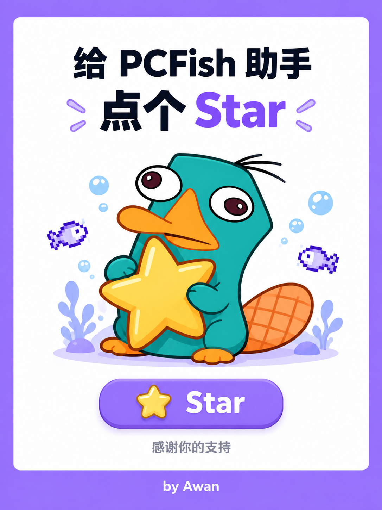

<p align="center">
  
  <a href="https://github.com/buguniaoOVO/PCFishController"></a>
</p>

# PCFish 助手（BepInEx 插件 + 独立控制器）

English: [README.en.md](README.en.md)

助手启动后会自动隐藏 BepInEx 控制台，日志仍写入文件。

挂机养鱼游戏 PCFish 的后台助手。繁育和鱼缸升级交给程序代跑，游戏窗口在后台或被别的窗口盖住时照常工作，不占用你的鼠标和键盘。

## 项目介绍

PCFish 的繁育是一份重复劳动：打开功能窗口、翻仓库挑两条鱼、点繁育、等动画、关掉结果窗，然后重复，直到心力用完。中途还得盯着冷却，等心力恢复再从头来一遍。人一直守着不划算。

这个助手把那套循环交给程序。它由两部分组成：

| 目录 | 作用 |
|---|---|
| `pcfish-autohelper/` | BepInEx 插件，在游戏进程内开一个只监听 `127.0.0.1` 的通道 |
| `PCFishController/` | 独立的桌面程序，显示状态并按设定发起动作 |

插件不碰游戏的界面对象，繁育走游戏自己的数据与网络入口。控制器是普通 WinForms 程序，想关就关，关掉不影响游戏。两者通过本机回环端口通信，默认 `27777`。

## 功能特点

### 后台运行，不抢鼠标键盘

- 不模拟鼠标和键盘，也不要求游戏窗口在前台
- 游戏最小化、被别的窗口盖住，或者你切去用别的程序时，助手照常工作
- 你同时操作电脑不受影响

### 自动繁育

- 按设定的间隔（默认 15~30 分钟随机）检查繁育计数器，有几颗心就繁育几次，用到 0 为止，然后回到等待
- 优先按你设置的目标路线选鱼；没有目标时按稀有度和星级从高到低挑
- 自动跳过冷却中、繁育次数耗尽、已锁定、以及已经摆出来展示的鱼
- 避免直系亲子配对；被服务端拒绝过的组合会短期跳过
- 每笔动作至少间隔 60 秒，插件和控制器各自执行一次限制
- 用亲鱼次数变化和新鱼 ID 双重核对结果，确认真的繁育成功才计入本轮

### 自动合成

- 仓库鱼数超过设定阈值（默认 900）时自动合成，每次 10 条
- 排除赛季鱼和赛季配方里用到的鱼，留作合成路线材料
- 优先使用 0 繁育次数的鱼，再按稀有度从低到高挑选
- 按真实点击顺序驱动游戏界面：打开功能窗口、切到合成标签、逐条点「+」放鱼、点「合成」
- 等合成动画播完、自动关掉结果弹窗，再关闭功能窗口；每一步之间留有间隔
- 游戏如果弹出「发生网络错误」这类提示，助手会点掉它并如实记录，稍后自动重试
- 「合成后安全等待」可设置，默认 5 秒，避免连着灌命令
- 提交后核对鱼群变化，不修改界面对象

### 弹窗自动关闭

游戏自己会弹「邀请好友领取免费爱心」的窗口（繁育计数器恢复时触发）。它会盖住功能窗口，用户和助手都点不到下面的内容。助手检测到这个弹窗就自动点它的「关闭」，走游戏自己的关闭入口，不碰其它弹窗。

### 服务器数据核对

本地缓存偶尔会和服务器不一致：服务器上次数已经用完的鱼，本地仍显示还剩一次。以前这会连着报「发生网络错误」，因为游戏把这种业务错误统一显示成了网络问题。现在每轮开始前先只读拉一次服务器数据，把这类鱼从候选里排除，仓库里也会标出「服务器次数用尽」。

这个核对只读，不调用游戏的数据恢复功能，不改写鱼群或存档。

### 图形界面

- 概览：运行状态（一键开启 / 全部关闭）、游戏进程、桥接连接、鱼群总数、繁育计数器、鱼缸等级
- 自动繁育：检查间隔、最低稀有度、每轮结束后是否检查鱼缸升级
- 自动合成：总开关、触发阈值、是否排除赛季鱼与配方鱼、合成后安全等待、手动「立即合成一次」，并显示当前仓库数量、候选数量和下一次检查时间
- 仓库：鱼种、稀有度、星级、剩余繁育次数、冷却时间、状态；支持搜索、筛选和点列头排序
- 合成路线：鱼名使用游戏内对应品质颜色；材料数量用黄、蓝、绿区分缺少、达标和可合成，表格与路线目标保持一致
- 日志与设置，界面支持中英文切换；关闭按钮可设为每次询问、直接退出或缩小至托盘
- 设置页有命令输入框：输入 /setting 直接打开设置，/help 列出命令
- 启动时与每小时自动检查 GitHub 版本，发现新版本时从托盘提示，可在设置里关闭；托盘右键也能手动检查
- 侧边栏图标为像素风小图标，选中时变蓝
- 每个页面右下角显示版本号和作者

### 一键部署

跑起来原本要走一串手工步骤：装 BepInEx、放插件、启动游戏等配置生成、再打开里面的动作总闸。现在这些合并成设置页的一个按钮。

点「一键部署」后它会依次完成：

1. 定位游戏目录（也可以手动指定）
2. 检测 BepInEx 运行环境，缺了就自动从官方构建站下载并安装
3. 把 PCFishAutoHelper.dll 复制到 BepInEx 的 plugins 目录
4. 首次部署时启动一次游戏，等插件生成配置文件，然后自动关掉这个进程
5. 打开配置里的动作总闸，并让端口和控制器一致

全程异步执行，每一步的进度实时写在按钮下方的状态区，同时进日志。装完按提示启动游戏，助手就会自动连上。以后换了电脑或改了游戏目录，再点一次就行。

### 安全设计

- 通道只绑 `127.0.0.1`，不对局域网开放
- 游戏内配置里的「允许外部执行动作」是总闸，默认关闭
- 控制器另有独立的 ARM 开关
- 出错时停止当前动作并暂停，不会连续重发请求
- 日志不记录任何认证令牌

## 环境要求

- Windows 10/11 64 位
- 游戏 PCFish（Steam 版，Unity 6000.0.76f1，IL2CPP）
- 编译控制器需要 .NET 8 SDK
- 编译插件需要 .NET 6 SDK 或更高（目标框架 net6.0）

BepInEx 6 运行环境由助手自动安装，不需要提前准备。开发时使用的是 6.0.0-be.788。

插件引用的 BepInEx 核心程序集与 `GameAssembly` 生成的 interop 程序集都来自游戏本身，不随仓库分发。因此插件必须在装了游戏和 BepInEx 的机器上编译。

## 下载即用

不想自己编译的话，直接到 [Releases](https://github.com/buguniaoOVO/PCFishController/releases/latest) 下载 `PCFishController-v*.zip`，解压后里面是：

| 文件 | 说明 |
|---|---|
| `PCFishController.exe` / `PCFish助手.exe` | 控制器，双击运行。自带运行时，不需要另装 .NET |
| `PCFishAutoHelper.dll` | 游戏插件，复制到 `BepInEx\plugins\` |
| `READ-ME-FIRST.txt` | 四步快速上手 |

压缩包约 116 MB，主要是控制器的运行时。程序图标是像素风鸭嘴兽泰瑞。

## 一键部署

设置页的「一键部署」把运行前的准备一次做完：

1. 定位游戏目录（留空自动查找，找不到就点「浏览…」手动指定）
2. 检测 BepInEx 运行环境；没有就从 builds.bepinex.dev 抓最新版本，按游戏运行时自动选包
   （PC FISH 是 IL2CPP，取 BepInEx-Unity.IL2CPP-win-x64），解压到游戏根目录。
   覆盖已装版本前，会把被覆盖的文件备份到游戏目录下的 BepInEx-backup-时间戳 文件夹。
3. 把 PCFishAutoHelper.dll 复制到 BepInEx 的 plugins 目录
4. 首次部署时启动一次游戏，等插件生成 pcfish.autohelper.cfg，然后自动关闭这个进程
5. 打开 cfg 里的「允许外部执行动作」，并让端口与控制器一致

第 2、3 步要写游戏目录，所以开始前请退出游戏：winhttp.dll 和插件 DLL 在游戏运行时被占用。
第 4 步启动的那次游戏由助手自己关掉，不需要手动干预。

## 版本更新

控制器内置更新检查，在「设置 → 版本更新」里：

- 点「检查更新」比对 GitHub 上的最新发布，显示新版本号和压缩包大小
- 有新版本时出现「立即更新」，点确认后自动下载、替换并重启
- 不想更新的版本可以不管，也可以点「打开发布页」到网页上看更新内容

更新只替换程序文件（控制器 exe 和插件 dll），不会动你的配置和游戏数据。
替换由一段批处理在当前程序退出后执行，因为运行中的 exe 无法覆盖自己；
替换完成后程序会自动重新启动。检查更新不发送任何账号信息，也不使用令牌。

## 编译

控制器不依赖游戏目录，任何装了 .NET 8 SDK 的机器都能编译：

```powershell
dotnet build .\PCFishController\PCFishController.csproj -c Release
dotnet publish .\PCFishController\PCFishController.csproj -c Release -o .\publish
```

插件需要指定游戏目录，`AutoHelper.csproj` 里的默认值只适用于原开发机：

```powershell
dotnet build .\pcfish-autohelper\AutoHelper.csproj -c Release -p:GameDir="D:\SteamLibrary\steamapps\common\PC FISH"
```

产物分别位于 `pcfish-autohelper\bin\Release\PCFishAutoHelper.dll` 与 `publish\PCFishController.exe`。

## 安装

推荐用仓库根目录的脚本编译并部署，它会编译插件、装到游戏目录，并把游戏内的动作总闸打开：

```powershell
powershell -ExecutionPolicy Bypass -File .\build-and-deploy.ps1 -GameDir "D:\SteamLibrary\steamapps\common\PC FISH"
```

脚本会把插件和控制器一起准备好，并把 `PCFishAutoHelper.dll` 放在控制器旁边，这样界面里的「一键部署」按钮以后能直接找到它。省略 `-GameDir` 时会自动到 Steam 常见路径里找游戏。运行前请先退出游戏，插件 DLL 在游戏运行时被锁定。

也可以让助手自己完成：

1. 双击运行控制器 `PCFishController.exe`。
2. 打开「设置」页，确认游戏目录（留空会自动查找），点「一键部署」。
3. 看状态区跑完，按提示启动游戏。
4. 在控制器上点「ARM」放行动作。

想手工装也行：把 `PCFishAutoHelper.dll` 放进 `BepInEx\plugins\`，启动一次游戏让它生成 cfg，再把 cfg 里的「允许外部执行动作」改成 `true`。

## 繁育流程

每轮开始前，控制器先通过游戏自身的 GET 入口只读核对服务器上的剩余繁育次数，据此排除本地缓存里次数已失效的鱼，然后才挑两条符合条件的亲鱼。

繁育请求走 `NetworkManager.FishBreed`，成功后依次执行游戏自己的收尾：回包 `_Breed_b__20_2`、动画结束 `UIFishResultFx.FinishFx`、结果确认 `UIFishResult.Confirm`。只有这三步都完成，输入锁才会释放，鱼缸动画和结果页才不会残留。

核对与繁育都由插件在游戏主线程内完成，控制器只负责发命令和读结果。

## 常见问题

控制器显示「桥接未连接」：游戏没开，或插件没装成功，或端口不一致。先确认 `BepInEx\LogOutput.log` 里有插件加载记录。刚装好 BepInEx 的机器第一次启动要先按 GameAssembly 生成 interop 程序集，插件可能要多等一两分钟才加载。

游戏弹出「服务器正在维护中」：这是游戏自己的提示。它的网络请求超时后，会把结果统一显示成维护或网络错误。游戏日志 `%USERPROFILE%\AppData\LocalLow\NANOO COMPANY Inc_\PCFish\Player.log` 里能看到真实原因，例如 `Curl error 28: Connection timed out`。遇到时先确认网络通畅，再重启游戏。

繁育提示「发生网络错误」：这是游戏对业务错误的统一提示。打开控制器日志查看真实原因，常见情况是所选鱼在服务器端已无剩余繁育次数，正常情况下助手会在每轮开始前把它排除掉。

打开功能窗口后只有图标、内容空白、按键无反应：这是旧版本遗留的输入锁问题，当前版本已通过补齐原生收尾解决。若仍遇到，请把控制器日志一并提交。

任务栏图标不是当前图标：Windows 会缓存快捷方式图标，删掉旧快捷方式后重新创建即可。

## 支持作者

这个助手免费开源。如果它帮你省下了守着繁育的时间，可以请作者喝杯奶茶。

扫码页首的发电图支持作者，也可以在仓库页面点 Star。

## 运行时文件

控制器会在 exe 同目录生成 `PCFish控制器配置.json`、`PCFish控制器.log`、`PCFish亲缘关系.json`、`PCFish失败配对.json`、`PCFish Wiki数据库.json`。这些都属于本地数据，已在 `.gitignore` 中排除。

## 免责声明

仅供个人在单机自用场景下学习和研究使用。自动化操作可能违反游戏的服务条款，由此产生的任何后果由使用者自行承担。

